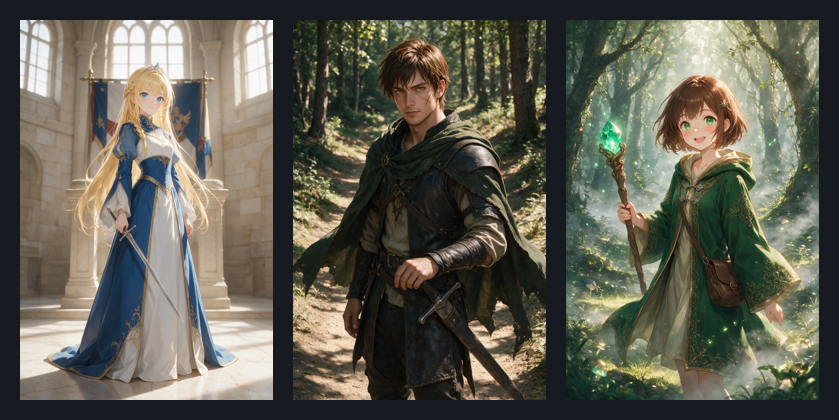
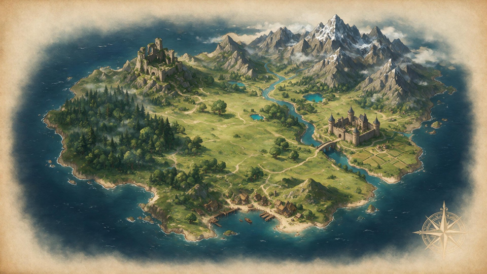
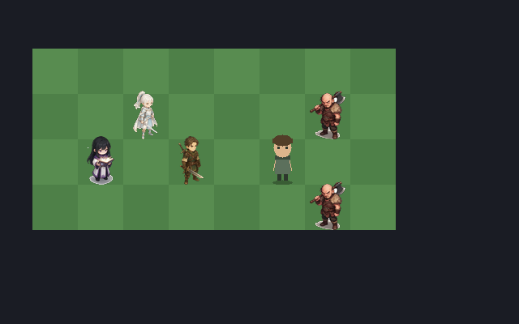

<div align="center">

# ⚔️ 剑与魔法 · 战旗

**一款《火焰纹章》式复古战棋 SRPG · Godot 4 垂直切片**

[](https://godotengine.org)
[]()
[]()
[]()

*流亡的公主 · 陷落的王都 · 一场藏在叛乱背后的阴谋*

[🎮 玩法](#-玩法) · [✨ 特性](#-特性) · [🚀 运行](#-运行) · [🛠️ 开发](#️-开发) · [📖 剧情](#-剧情)

</div>

---

## 📖 剧情

> 那一夜，王都的钟声没有响起。
>
> 叛军攻破城门，火光吞没了王宫。王国在一夜之间倾覆。
> 流亡的公主 **莉拉**、报恩的佣兵 **加勒特**、月神教团的幸存者 **米拉**——
> 三个无家可归的人踏上逃亡之路，却不知这场叛乱背后，藏着颠覆整个大陆的阴谋。

<div align="center">

</div>

---

## 🎮 玩法

经典战棋回合制：在网格地图上移动单位、占领地形、攻击敌人，达成关卡目标。

| 操作 | 按键 / 鼠标 |
|---|---|
| 选择单位 / 移动 | 鼠标左键点击 |
| 查看移动路径 | 悬停可移动格（白色路径预览） |
| 攻击 / 待命 / 道具 | 移动后弹出行动菜单 |
| 原地攻击 | 点击已选中的自己 |
| 查看敌方范围 | 点击敌人（蓝色移动 / 红色攻击） |
| 取消行动 | `Esc`（返回原位） |
| 系统菜单 | `Esc`（结束回合 / 存档 / 回大地图） |
| 营地（角色/支持/道具） | 大地图按 `C` |
| 移动视角（大地图关卡） | 方向键 |

**战斗预测**：攻击前悬停敌人，右上方面板实时显示命中率 / 伤害 / 暴击 / 武器相克与预计残血。

---

## ✨ 特性

### ⚔️ 战斗系统
- 网格移动 + **逐格路径行走动画**（非瞬移）
- **地形系统**：平原 / 森林 / 山地 / 要塞 / 墙 / 水域（影响移动消耗、回避、防御）
- **武器三角克制**：剑 > 斧 > 枪 > 剑；理 > 光 > 暗 > 理
- 攻击前**武器选择菜单**（威力 / 命中 / 暴击一览）
- 命中 / 暴击判定、反击、追击（速度差）、暴击特写
- **经验条演出** + 升级属性成长 + 武器熟练度（E → S）

### 🏰 养成与策略
- **支持系统**：并肩作战积累羁绊，C/B/A 级解锁对话与属性加成
- **技能**：被动光环（守护/破甲/光之护佑）+ 主动技
- **转职**：Lv10 + 转职圣印 → 进阶职业（领主→大领主→圣王）
- **永久死亡模式**：可选——阵亡即永久退场，或重伤撤退
- **营地**：角色名册 / 支持回放 / 道具库

### 🗺️ 大地图探索
- 圣魔之光石式**节点大地图**，主支线 + 隐藏关
- 队伍小人在地图上**沿路径行走**移动
- **抉择点**：剧情分支（如「收编俘虏 / 处决」「霜峰捷径 / 河谷大道」）影响后续关卡与奖励
- 永久死亡 / 队伍状态 / 道具一览

### 📜 剧情演出
- 全屏剧情对话系统（说话人 + 立绘 + 逐行文本）
- **数据驱动**：开场 / 过关 / 进关剧情，写在 `data/story.json` 即可，无需改代码

### 💾 其他
- 自动存档 / 读档（通关、抉择、养成进度）
- AI 生成美术：角色立绘 + 5 帧战斗精灵表 + 手绘风世界地图

---

## 🖼️ 画面

<div align="center">

<p><i>大地图 —— 节点探索与剧情分支</i></p>

<p><i>战斗 —— 地形、范围预览与属性面板</i></p>
</div>

---

## 🚀 运行

### 环境
- [Godot Engine 4.2+](https://godotengine.org/download)（标准版即可，无需 .NET）

### 步骤
```bash
git clone https://github.com/ssy2886/srpg.git
```
1. 打开 Godot → **导入** → 选择 `srpg/project.godot`
2. 按 `F5`（或点击运行）即可游玩

> 首次打开编辑器会自动完成资源导入（生成 `.import` 元数据）。

---

## 🛠️ 开发

### 技术栈
- **引擎**：Godot 4.2（Forward+）
- **语言**：GDScript
- **架构**：数据驱动（JSON）+ Autoload 单例（DataManager / Campaign / SaveManager）

### 目录结构
```
srpg/
├── data/               # 数据表（JSON，全部可调）
│   ├── characters.json #   角色（属性/成长/背景）
│   ├── classes.json    #   职业（武器等级/技能）
│   ├── weapons.json    #   武器（威力/命中/三角）
│   ├── terrain.json    #   地形（消耗/回避/防御）
│   ├── skills.json     #   技能
│   ├── story.json      #   剧情对话
│   ├── decisions.json  #   抉择点（剧情分支）
│   ├── world.json      #   大地图节点
│   └── maps/           #   关卡地图（地形格 + 单位）
├── src/                # 源码（GDScript）
│   ├── BattleController.gd  # 战斗主控
│   ├── Combat.gd            # 移动/攻击/命中纯逻辑
│   ├── Unit.gd              # 单位（属性/动画/经验）
│   ├── WorldMap.gd          # 大地图
│   ├── Camp.gd              # 营地
│   ├── StoryDialog.gd       # 剧情演出
│   └── ...
├── assets/             # 美术（AI 生成）
│   ├── portraits/      #   立绘
│   ├── sprites/units/  #   5 帧战斗精灵表
│   └── worldmap/       #   世界地图背景
└── scenes/             # Godot 场景
```

### 扩展内容（无需改代码）
| 想加什么 | 改哪个文件 |
|---|---|
| 新角色 / 敌人 | `data/characters.json` + 精灵表 |
| 新职业 / 转职 | `data/classes.json` |
| 新武器 | `data/weapons.json` |
| 新关卡 | `data/maps/*.json` + `world.json` 加节点 |
| 新剧情 | `data/story.json`（`{关卡id}_enter` / `_clear`） |
| 新抉择分支 | `data/decisions.json` |

详见 [`开发计划.md`](开发计划.md) 与 [`美术资源生成指南.md`](美术资源生成指南.md)。

---

## 🎨 美术说明

本项目美术资源由 **AI 图像生成**产出，再由代码统一处理为可用素材：
- 角色立绘：`assets/portraits/`
- 战斗精灵：5 帧横排精灵表（站立/行走/攻击/受击/倒地），320×64
- 世界地图：手绘羊皮卷风背景

精灵处理管线（去背景 → 帧分割 → 对齐 → 拼表）见 `美术资源生成指南.md`。

---

## 🗺️ 路线图

- [x] 核心战斗循环（移动/攻击/回合）
- [x] 地形 + 武器三角 + 命中暴击
- [x] 支持系统 + 抉择分支
- [x] 大地图 + 剧情演出
- [x] 转职 + 永久死亡
- [ ] 更多关卡（第一章完整流程）
- [ ] 战斗动画强化（攻击特效/法术动画）
- [ ] 角色立绘对话表情差分
- [ ] 音效与 BGM
- [ ] Steam 商店页 / Demo 发布

---

## 📄 License

代码：[MIT](LICENSE)
美术资源：AI 生成，仅供学习交流

---

<div align="center">

**用 ❤️ 和 Godot 制作**

如果这个项目对你有帮助，欢迎 ⭐ Star

</div>
